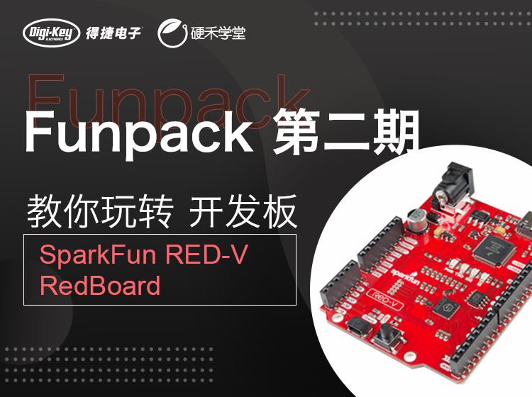
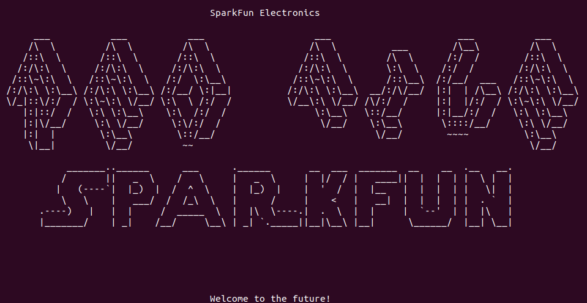

# RED-V
RED-V 是一个低成本的开源开发板，大小和流行的 Arduino 板子一样，接口兼容 Arduino Uno R3 版。板子采用了全贴片设计，没有通孔焊接，所以不用担心背面短路。

- <https://github.com/sifive/freedom-e-sdk>
- <https://www.sifive.com/software>
- <https://www.sifive.com/chip-designer>
- <https://www.eetree.cn/doc/detail/2040>