# SparkFun Red-V 快速入门


RISC-V（发音为“risk-five”）是一个基于精简指令集（RISC）原则的开源指令集架构（ISA），可用于实现各种微控制器和微处理器。[SiFive](https://www.sifive.com/) 是一家无晶圆厂的半导体公司，该公司基于 RISC-V ISA 设计和生产微控制器和微处理器。

在本教程中，我们将通过几个不同的开发环境，介绍如何使 SparkFun Red-V 板上的 LED 闪烁。[youtube 视频](https://www.youtube.com/embed/Q5lDJNXyNpU?enablejsapi=1;origin=https://www.maker.io)


## SparkFun Red-V 开发板

SparkFun 设计了两款基于 SiFive E310 微处理器的开发板。

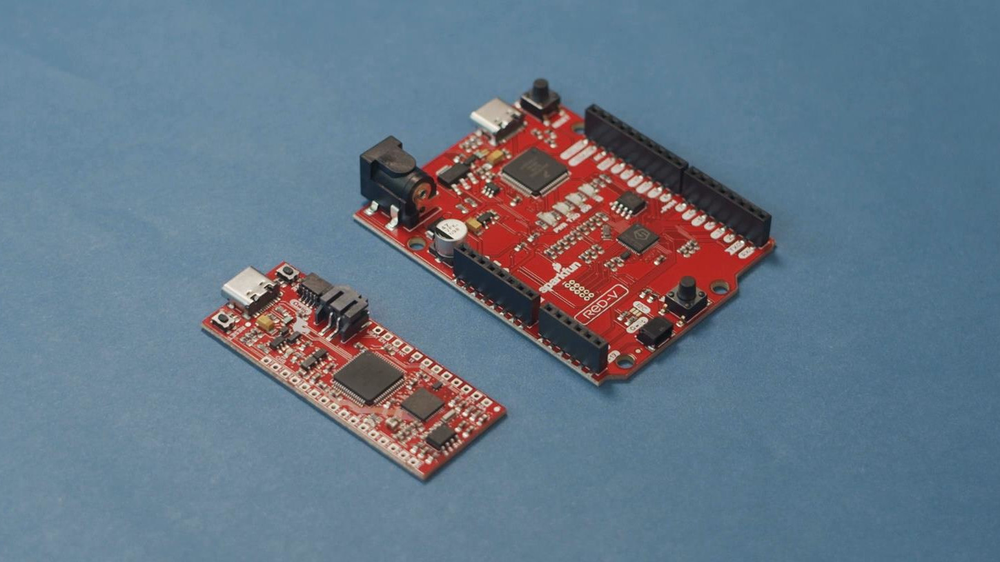

Red-V RedBoard 具有 Arduino 的尺寸和接口，方便快速接入已有的 Arduino 模块。另一款 Red-V Thing Plus board 则更方便连接到面包板上。

在两块板上都能找到的主要微控制器是 SiFive FE310-G002，它具有以下功能：

- 32 bit RV32IMAC core
- 256 MHz (最高 320 MHz)
- 16 kB RAM
- 4 MB 板载 SPI flash

详细介绍请看《[ guide from SparkFun to learn more about the Red-V RedBoard ](https://learn.sparkfun.com/tutorials/red-v-redboard-hookup-guide)》和《[ guide to learn more about the Red-V Thing Plus ](https://learn.sparkfun.com/tutorials/red-v-thing-plus-hookup-guide)》

下面将介绍两种不同的 Red-V 开发方式。第一种是使用 Freedom Studio IDE，它是一个基于 [Eclipse IDE](https://www.eclipse.org/ide/) 的集成开发环境，我们可以使用 Freedom Metal hardware abstraction layer (HAL) 库进行编程，直接操控微处理器（即裸机编程）。第二种方法是使用 [Zephyr Project](https://www.zephyrproject.org/)，Zephyr 是一个免费和开源的实时操作系统（RTOS），它包含了许多库，帮助开发者轻松使用网络、安全和数字通信等功能。

请注意，目前 Freedom Studio 可在3种主要操作系统（Windows，Mac 和 Linux）上使用，而 Zephyr Project 仅可在 Linux 上使用。


## Freedom Studio

Freedom Studio 的下载地址是 <https://www.sifive.com/boards/#software>，安装前建议阅读《[ this guide from SparkFun ](https://learn.sparkfun.com/tutorials/red-v-development-guide#software-installation-freedom-studio)》文档以便于安装相关驱动程序（Windows）。

首次启动 Freedom Studio 时，将显示一个弹出窗口，要求您设置工作区。 我这里使用默认配置，然后单击“Launch”启动。

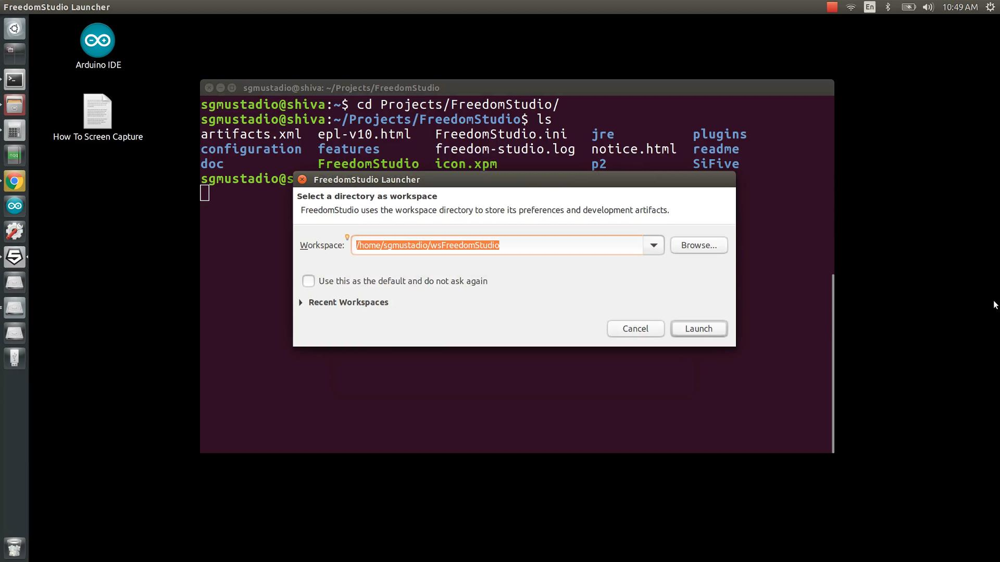

Close out of any other pop-ups, and in the main application, click **File > New > Freedom E SDK Software Project**. Change the *Target* to **sifive-hifive1-revb**, as the Red-V board is based on the HiFive1-RevB board. Change the *Example Program* to **hello**, which will give us a standard “Hello, World” template to start with. Change the name of the project to anything you want (e.g. “red-v-hello”).

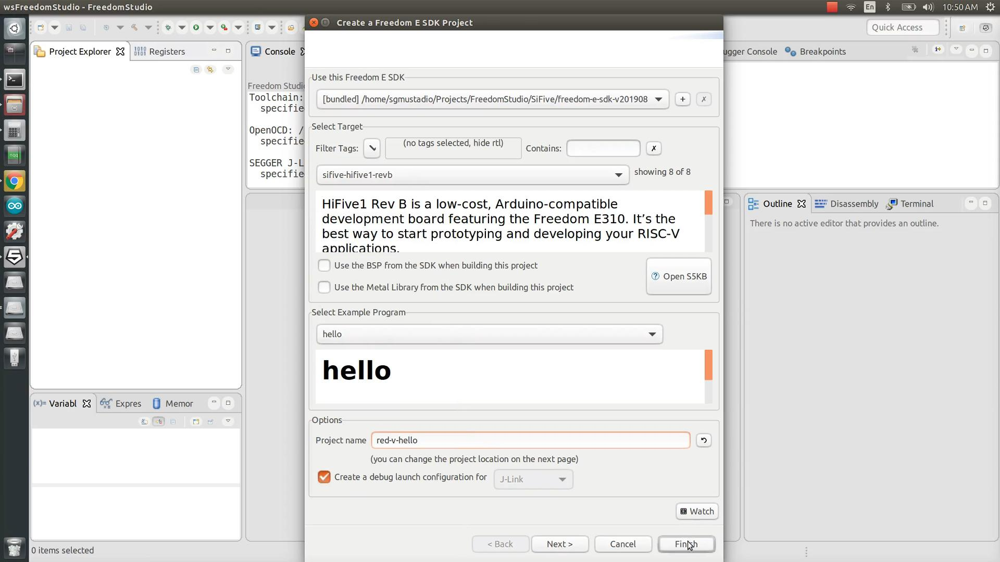

Click **Finish** and wait while the project builds. If asked to save changes for the configuration settings, click **Don’t Save**. You should be presented with a simple program that prints the string “Hello, World!\n” once to the console using printf. Because the string only prints once, you might miss is and have to press the reset button whenever you connect a serial console to the board.

To get around this, I’m going to add a simple forever loop around the print statement, so that it will continually try to print to the console. It’s a little messy, but it gets the job done:

```c
/* Copyright 2019 SiFive, Inc */
/* SPDX-License-Identifier: Apache-2.0 */

#include <stdio.h>

int main() {
  while(1) {
    printf("Hello, World!\n");
  }
}
```

Save the file, and click on **Run > Run Configurations**. In the left pane, click on **SiFive GDB SEGGER J-Link Debugging > red-v-hello** (or whatever you named your project). Make sure that you have a *.elf* file listed under *C/C++ Application*, and click **Run**.

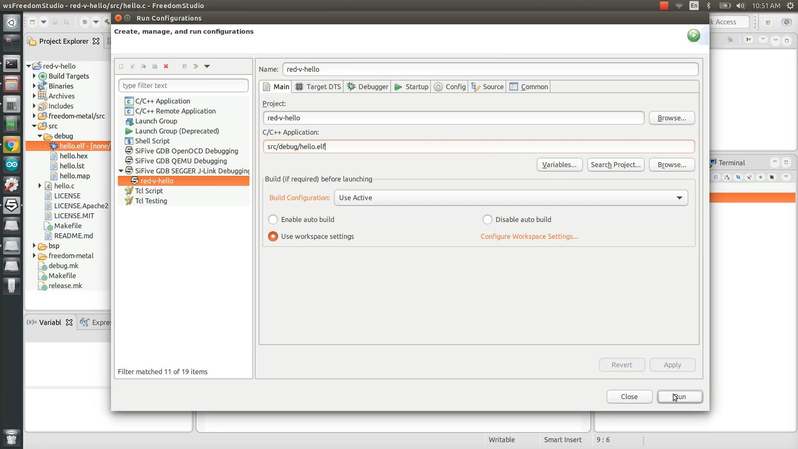

Once your project is done building, click on the **Launch Terminal** button under the *Terminal* tab in the bottom-right pane. This will bring up a window asking you to configure your serial connection.

The Red-V board enumerates 2 different serial ports for programming and debugging. The printf() statement uses one of them, and it’s usually the *second-highest port number*. In this example, I had /dev/ttyACM1 and /dev/ttyACM2 listed as device files (i.e. these might be COM ports on Windows), so I chose to connect to /dev/ttyACM1. Try both if one does not seem to be working. Leave the baud rate at 115200, data size of 8, no parity, and 1 stop bit. 

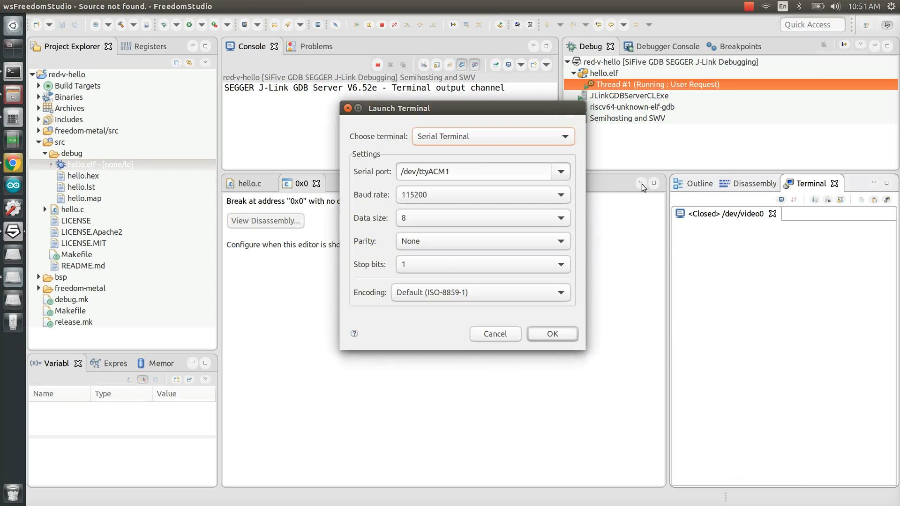

Click **OK**. You should see the phrase “Hello, World!” being printed repeatedly in the console in the bottom-right pane.

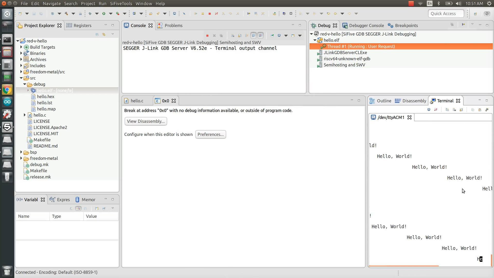

Click the **Stop Button** to halt the processor.

Let’s click **File > New > Freedom E SDK** and follow the same steps as above to create a new project for the *hifive1-revb* board based on the *hello* example program again. Give the project a new name, like *red-v-blinky*.

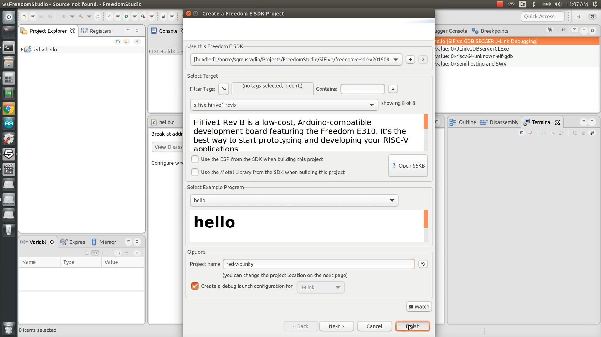

Close out of any pop-ups, not saving changes. Replace the default code with the following code from SparkFun:

```c
/******************************************************************************
    RED-V_blink.c

    WRITTEN BY: Ho Yun "Bobby" Chan and "Tron Monroe"
    @ SparkFun Electronics
    DATE:  11/21/2019

    DEVELOPMENT ENVIRONMENT SPECIFICS:
      Firmware developed using Freedom Studio v4.12.0.2019-08-2
      on Windows 10

    ========== RESOURCES ==========
    Freedom E SDK

    ========== DESCRIPTION ==========
    Using the built-in LED. To test with different pin,
    simply modify the reference pin and connect a standard LED
    and 100?O resistor between the respective pin and GND.

    LICENSE: This code is released under the MIT License (http://opensource.org/licenses/MIT)
  ******************************************************************************/


#include <stdio.h>      //include Serial Library
#include <time.h>       //include Time library
#include <metal/gpio.h> //include GPIO library, https://sifive.github.io/freedom-metal-docs/apiref/gpio.html

//custom write delay function since we do not have one like an Arduino
void delay(int number_of_microseconds){ //not actually number of seconds

// Converting time into multiples of a hundred nS
int hundred_ns = 10 * number_of_microseconds;

// Storing start time
clock_t start_time = clock();

// looping till required time is not achieved
while (clock() < start_time + hundred_ns);

}

int main (void) {
  printf("RED-V Example: Blink\n");

  struct metal_gpio *led0; //make instance of GPIO

  //Note: The sequence of these commands matter!

  //Get gpio device handle, i.e.) define IC pin here where IC's GPIO = 5, pin silkscreen = 13
  //this is the GPIO device index that is referenced from 0, make sure to check the schematic
  led0 = metal_gpio_get_device(0);

  // quick check to see if we set the metal_gpio up correctly, this was based on the "sifive-welcome.c" example code
  if (led0 == NULL) {
    printf("LED is null.\n");
    return 1;
  }

  // Pins are set when initialized so we must disable it when we use it as an input/output
  metal_gpio_disable_input(led0, 5);

  // Set as gpio as output
  metal_gpio_enable_output(led0, 5);

  //Pins have more than one function, make sure we disconnect anything connected... 
  metal_gpio_disable_pinmux(led0, 5); 

  //Turn ON pin 
  metal_gpio_set_pin(led0, 5, 1);

  while (1) {//loop through, sort of like an Arduino loop()

      //Turn OFF pin
      metal_gpio_set_pin(led0, 5, 0);
      //Use custom "delay" function
      delay(2000000); //2000000 "micro-seconds" ~ 1 second, through experimentation...
      //Turn ON pin
      metal_gpio_set_pin(led0, 5, 1);
      //Use custom "delay" function
      delay(2000000);

  }

  // return
  return 0;
}
```

You will notice that we’re blinking pin 5 in this code, which is the pin connected to the onboard LED on the Red-V boards. You can view the schematics for the Red-V boards here:

[Red-V RedBoard schematic](https://cdn.sparkfun.com/assets/9/d/e/8/2/SparkFun_REDV_RedBoard-Schematic.pdf)

[Red-V Thing Plus schematic](https://cdn.sparkfun.com/assets/3/1/0/1/9/SparkFun_REDV_Thing_Plus-Schematic.pdf)

Save your file and click **Run > Debug Configurations**. Once again, make sure you have a *.elf* file listed under *SiFive GDB SEGGER J-Link Debugging > red-v-bliny* (or whatever you named your project). Click **Debug**. 

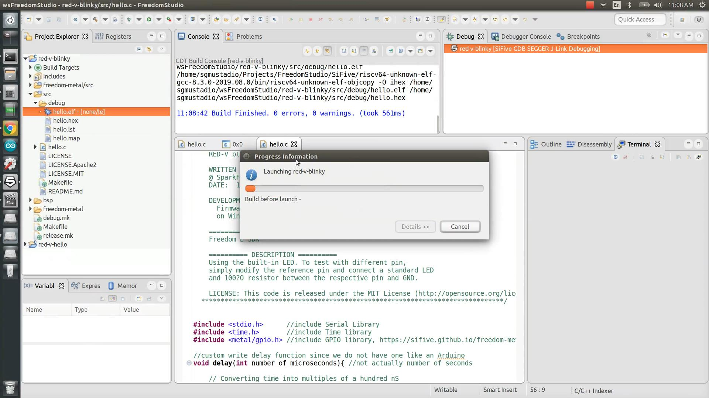

You can double-click to the left of code lines to add breakpoints and use the toolbar to resume and pause program execution as well as step into, over, and out of functions. This provides an easy way to perform step-through debugging on the SiFive processor using the onboard J-Link chip.

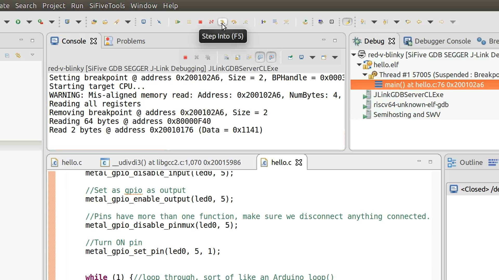

While doing this, you should see the blue LED flash on the Red-V board.

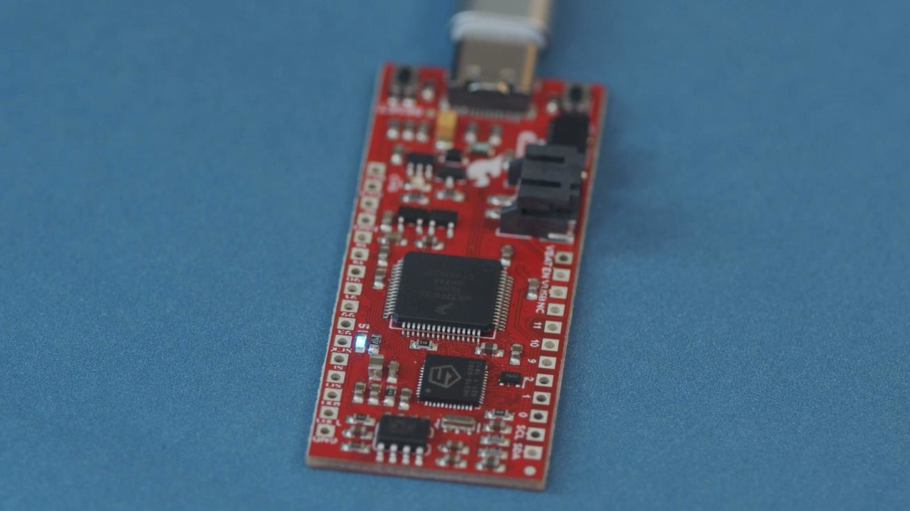

Press the *stop button* to stop program execution and exit the GDB debugger when you are finished.

SiFive maintains the Freedom Metal HAL, which is a library that makes it easy to develop bare-metal programs for their chips. You can view the API documentation here: https://sifive.github.io/freedom-metal-docs/introduction.html

## Zephyr Project

The [Zephyr Project](https://www.zephyrproject.org/) is a framework maintained by the Linux Foundation that aims to make a universal and accessible RTOS for many different microcontrollers. In addition to a task scheduler, Zephyr aims to provide various libraries for networking, security, and hardware control, which would make code written for Zephyr portable to many different microcontrollers.

Zephyr is still young at this point, so board support is limited, and it only builds under Linux. If you wish to try out the Zephyr Project for the Red-V (and similarly, the HiFive-revB board), follow the installation steps found here: https://learn.sparkfun.com/tutorials/red-v-development-guide#software-installation-zephyr-rtos. Note that I tried the following steps on Ubuntu 16.04.

Once you have Zephyr installed on your system, navigate to *zephyrproject/zephyr/samples/basic*. Make a copy of the *blinky* folder and rename it to something like *blink_red-v*.

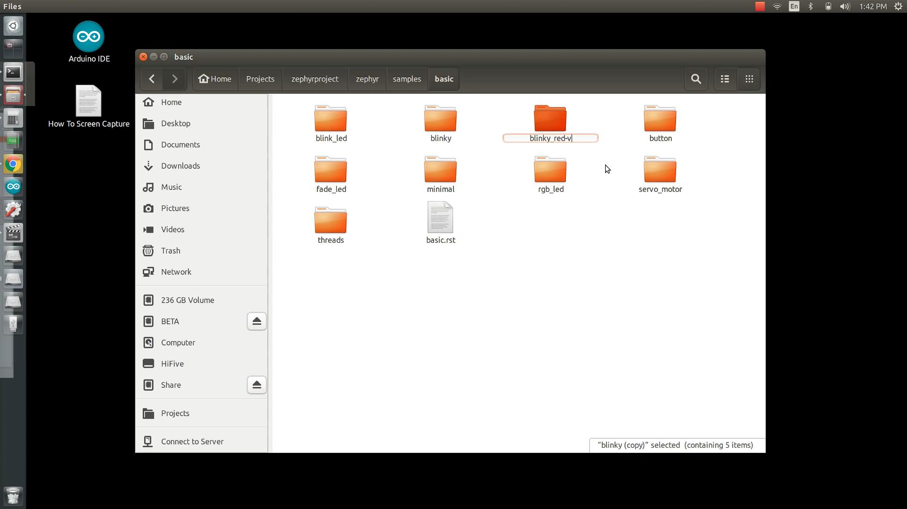

Go into that folder and into the *src* subfolder. Open **main.c**. The HiFive1-revB board has a predefined pin with DT_ALIAS_LED0_GPIOS_PIN constant that points to the pin connected to the onboard LED. Unfortunately, that is not the same pin used on the Red-V board. So, replace that constant with the number 5 (which corresponds to pin 5 on the board):

```c
/*
 * Copyright (c) 2016 Intel Corporation
 *
 * SPDX-License-Identifier: Apache-2.0
 */

#include <zephyr.h>
#include <device.h>
#include <drivers/gpio.h>

#define LED_PORT    DT_ALIAS_LED0_GPIOS_CONTROLLER
#define LED     5

/* 1000 msec = 1 sec */
#define SLEEP_TIME  1000

void main(void)
{
    u32_t cnt = 0;
    struct device *dev;

    dev = device_get_binding(LED_PORT);
    /* Set LED pin as output */
    gpio_pin_configure(dev, LED, GPIO_DIR_OUT);

    while (1) {
        /* Set pin to HIGH/LOW every 1 second */
        gpio_pin_write(dev, LED, cnt % 2);
        cnt++;
        k_sleep(SLEEP_TIME);
    }
}
```

Save that file, and open a terminal window. Navigate to the zephyr folder (in whichever directory you installed the Zephyr Project):

```shell
cd ~/Projects/zephyrproject/zephyr/
```

From there, use the *west* metatool to build our sample program with the HiFive1-revB as the target board:

```shell
west build -b hifive1_revb samples/basic/blinky_red-v/
```

Once that’s done, simply call the following to upload the compiled program to the board:

```shell
west flash
```

At this point, you should see the LED on the Red-V board begin to blink. Note that Zephyr has some overhead, so it might take a few seconds for it to boot on the board after each reset.


The API reference guide for the Zephyr Project can be found here: https://docs.zephyrproject.org/latest/reference/index.html

## Resources and Going Further

We hope this has helped you get started with the new SparkFun Red-V boards! While there is no easy IDE (e.g. Arduino), to get you running with this set of RISC-V chips, there are some professional tools and a growing RTOS that holds a lot of promise.

Here are some resources to help you on your Red-V journey:

- [Red-V RedBoard Hookup Guide](https://learn.sparkfun.com/tutorials/red-v-redboard-hookup-guide)
- [Red-V RedBoard Schematic](https://cdn.sparkfun.com/assets/9/d/e/8/2/SparkFun_REDV_RedBoard-Schematic.pdf)
- [Red-V Thing Plus Hookup Guide](https://learn.sparkfun.com/tutorials/red-v-thing-plus-hookup-guide)
- [Red-V Thing Plus Schematic](https://cdn.sparkfun.com/assets/3/1/0/1/9/SparkFun_REDV_Thing_Plus-Schematic.pdf)
- [Red-V Programming Guide](https://learn.sparkfun.com/tutorials/red-v-development-guide)
- [SiFive Freedom Metal API Reference](https://sifive.github.io/freedom-metal-docs/introduction.html)
- https://docs.zephyrproject.org/latest/reference/index.html