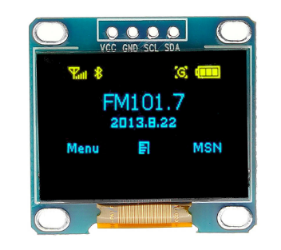
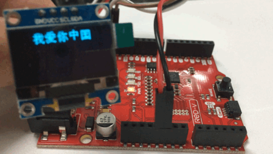

# 驱动 I2C 显示 OLED 屏

打开 FreedomStudio 软件，依次在菜单栏中选择【File】->【New】->【Freedom E SDK Software Project】新建工程。

在 Select Target 中选择“sifive-hifive1-revb”，在 Select Example Program 中选择“example-i2c”示例程序。接下来我们将修改这个程序。

虽然 E310 只有一个 I2C 外设，但是 RED-V 板卡上引出了 3 组接口，包括 Arduino 插槽上的两组以及一个 Qwiic 接口。方便同时接入多个 I2C 设备，本次实验选择任意一组接口即可。

```json
i2c0: i2c@10016000 {
    compatible = "sifive,i2c0";
    interrupt-parent = <&plic>;
    interrupts = <52>;
    reg = <0x10016000 0x1000>;
    reg-names = "control";
    clocks = <&hfclk>;
    pinmux = <&gpio0 0x0 0x3000>;
};
```

首先，我们还是先通过 `metal_i2c_get_device` 获取 i2c0 对象，再进行初始化操作。

```c
#include <metal/cpu.h>
#include <metal/i2c.h>
#include <metal/io.h>
#include <metal/machine.h>
#include <metal/uart.h>
#include <stdio.h>
#include <time.h>

#define OLED_I2C_ADDRESS	   0x3C
#define I2C_BAUDRATE        100000

static struct metal_i2c *i2c_bus;

int main(void) 
{
    i2c_bus = metal_i2c_get_device(0);
    
    if (i2c_bus == NULL) {
        printf("I2C not available \n");
        return RET_NOK;
    }
    
    metal_i2c_init(i2c_bus, I2C_BAUDRATE, METAL_I2C_MASTER);
}
```

我们这里使用经典的 [I2C 接口 SSD1306 OLED 屏](https://s.click.taobao.com/t?e=m%3D2%26s%3DbcUO5jQ07iYcQipKwQzePOeEDrYVVa64LKpWJ%2Bin0XLjf2vlNIV67r1GV5BoHCb0oAgJVlbS%2FO%2BnFi3wFBXvYUtYIXyQ5%2BdaGX93X4IFTwPx%2FVncyXNiWXW0BscCR%2FBjdZr7RBnLmJomXO35yxsaceSDSb1WioN4Pg5xNw1GNnldU6xUmkLRg0x0inWuvg%2Fd&scm=null&pvid=null&app_pvid=59590_11.181.127.69_616_1604477665014&ptl=floorId%3A17741&originalFloorId%3A17741&app_pvid%3A59590_11.181.127.69_616_1604477665014&union_lens=lensId%3APUB%401604477656%400b093ddb_8806_17592521cee_de5c%40024sFT9EjhAnHEVLamncegAo)，驱动代码从 STM32 移植过来，只要调整 I2C 读写接口函数即可。



比如我们这里封装了如下几个接口函数：

```c
/* function */
void I2C_WriteByte(uint8_t addr,uint8_t data);
void WriteCmd(unsigned char I2C_Command);
void WriteDat(unsigned char I2C_Data);
void OLED_Init(void);
void OLED_SetPos(unsigned char x, unsigned char y);
void OLED_Fill(unsigned char fill_Data);
void OLED_CLS(void);
void OLED_ON(void);
void OLED_OFF(void);
void OLED_ShowStr(unsigned char x, unsigned char y, unsigned char ch[], unsigned char TextSize);
void OLED_ShowCN(unsigned char x, unsigned char y, unsigned char N);
void OLED_DrawBMP(unsigned char x0,unsigned char y0,unsigned char x1,unsigned char y1,unsigned char BMP[]);
```

实际上，所有对 OLED 屏的操作都是通过调用 `I2C_WriteByte` 接口进行写操作来实现的。因此，我们只需要对该接口进行改造即可。把 I2C 的地址和数据组装起来，再把它们传给 Freedom-e-sdk 提供的 `metal_i2c_write` 接口函数。

```c
void I2C_WriteByte(uint8_t addr,uint8_t data)
{
    uint8_t buf[2] = {addr, data};
    metal_i2c_write(i2c_bus, OLED_I2C_ADDRESS, 2, buf, METAL_I2C_STOP_ENABLE);
}
```

完整代码请看：<https://github.com/luhuadong/RED-V/tree/main/code/red-v-oled>

好啦，编译、下载程序，可以看到 OLED 显示效果。



