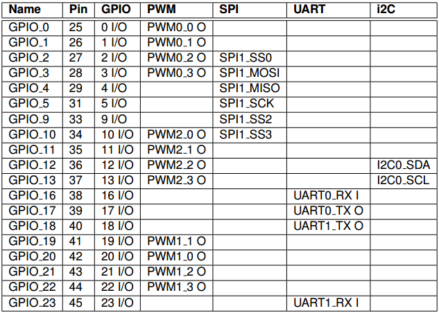
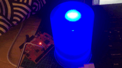

# 驱动 PWM 实现呼吸灯


打开 FreedomStudio 软件，依次在菜单栏中选择【File】->【New】->【Freedom E SDK Software Project】新建工程。

在 Select Target 中选择“sifive-hifive1-revb”，在 Select Example Program 中选择“example-pwm”示例程序。接下来我们将修改这个程序。

由于板载的 LED 连接的 D13（GPIO_5）引脚没有 PWM 功能，因此本次实验使用具有 PWM 输出功能的 D9（GPIO_1）。



E310 一共有三个 PWM 外设，GPIO_1 引脚对应 PWM0 的 1 通道。我们需要先通过 `metal_pwm_get_device` 获取 PWM0 对象，再进行操作。

```json
pwm0: pwm@10015000 {
    compatible = "sifive,pwm0";
    sifive,comparator-widthbits = <8>;
    sifive,ncomparators = <4>;
    interrupt-parent = <&plic>;
    interrupts = <40 41 42 43>;
    reg = <0x10015000 0x1000>;
    reg-names = "control";
    clocks = <&hfclk>;
    pinmux = <&gpio0 0x0F 0x0F>;
};
```

初始化 PWM 通道，然后周期性调节 PWM 占空比即可。应用程序具体代码如下：

```c
#include <metal/cpu.h>
#include <metal/pwm.h>
#include <metal/io.h>
#include <metal/machine.h>
#include <metal/uart.h>
#include <stdio.h>
#include <time.h>

/* Using PWM0_PWM1/GPIO1 (Arduino D9) */
#define PWM_DEV_NUM     0
#define PWM_CHANNEL     1

#define REMAIN_TIME     35
#define DUTY_MAX        47

void delay_ms(int ms) {
    clock_t begin = clock();
    while ((clock() - begin) < (ms * 1000));
}

int main(void) {
    /* Get a PWM device instance */
    pwm = metal_pwm_get_device(PWM_DEV_NUM);
    
    /* Enable PWM1 instance */
    metal_pwm_enable(pwm);
    /* Set PWM1 to 1Hz */
    metal_pwm_set_freq(pwm, PWM_CHANNEL, 1);
    /* Set Duty cycle and phase correct mode */
    metal_pwm_set_duty(pwm, PWM_CHANNEL, 90, METAL_PWM_PHASE_CORRECT_DISABLE);
    /* Start in continuous mode */
    metal_pwm_trigger(pwm, PWM_CHANNEL, METAL_PWM_CONTINUOUS);
    
    /* Loop forever */
    while (1) {
        for (i=0; i<=DUTY_MAX; i++) {
            metal_pwm_set_duty(pwm, PWM_CHANNEL, i, METAL_PWM_PHASE_CORRECT_DISABLE);
            delay_ms(REMAIN_TIME);
        }
        delay_ms(200);
        
        for (i=DUTY_MAX; i>=0; i--) {
            metal_pwm_set_duty(pwm, PWM_CHANNEL, i, METAL_PWM_PHASE_CORRECT_DISABLE);
            delay_ms(REMAIN_TIME);
        }
    }
    return 0;
}
```

编译、下载程序，可以看到呼吸灯效果。



