# 【RED-V】开发环境搭建及快速入门


## 开发工具介绍

RED-V 的主控芯片是 SiFive 的 FE310，因此 RED-V 支持多种开发方式，常见的开发方式是使用 SiFive 官方支持的 Freedom E SDK 和 Freedom Studio 工具。

- Freedom E SDK 包含多个板卡的板级支持包（BSP）、测试程序和示例程序。仓库地址：<https://github.com/sifive/freedom-e-sdk.git>
- Freedom Studio 是 SiFive 公司推出的一个集成开发环境（基于 Eclipse IDE），用来编写和调试基于 SiFive 处理器的软件。内嵌了编译好的 RISC-V GCC 工具链、OpenOCD、以及一些示例和文档。

得益于充满活力的 RISC-V 第三方生态系统的发展，我们还可以使用很多第三方工具进行开发。

- [Ashling RiscFree™ C/C++ for RISC-V](https://www.ashling.com/sifive)
- [GNU MCU Eclipse](https://gnu-mcu-eclipse.github.io/)
- [IAR Embedded Workbench for RISC-V](https://www.iar.com/iar-embedded-workbench/#!?architecture=RISC-V)
- [TRACE32® debugger for RISC-V](http://www.lauterbach.com/bdmriscv.html)
- [PlatformIO IDE](https://platformio.org/platformio-ide)
- [Embedded Studio](https://www.segger.com/products/development-tools/embedded-studio/editions/risc-v/)
- [Arduino IDE](https://www.arduino.cc/en/Main/software)

注意：这些第三方工具不是由 SiFive 开发和维护的，因此在投入实际生产之前，需要您进行更细致的评估。

除了 IDE，SiFive 的 FE310 芯片还支持 RTOS 开发，包括 Zephyr、FreeRTOS 和 RT-Thread 等。


## 安装 Freedom Studio

作为初次接触 SiFive 硬件开发的小伙伴，我们建议使用 Freedom Studio 进行开发。Freedom Studio 基于 Eclipse IDE，支持 Windows、macOS、Linux 三大系统平台。

下载地址：<https://www.sifive.com/software>

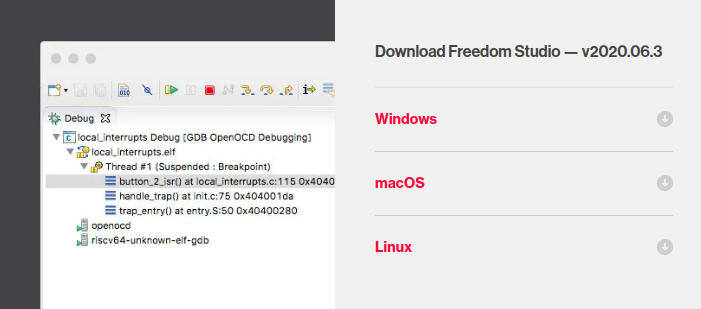

对于 Linux 系统，直接下载解压即可。

以 [FreedomStudio-2020-06-3-lin64.tar.gz](https://static.dev.sifive.com/dev-tools/FreedomStudio/2019.08/FreedomStudio-2019-08-1-lin64.tar.gz) 为例，将其解压到 /opt/FreedomStudio 目录。

```shell
tar zxvf FreedomStudio-2020-06-3-lin64.tar.gz -C /opt/FreedomStudio
```

通过命令行启动 FreedomStudio

```shell
cd /opt/FreedomStudio
./FreedomStudio
```

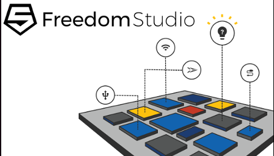

对于 Windows 系统，安装步骤稍微复杂一些。

将 [FreedomStudio-2020-06-3-win64](https://static.dev.sifive.com/dev-tools/FreedomStudio/2020.06/FreedomStudio-2020-06-3-win64.zip) 解压到非中文字符且不含空格的目录下（需要耐心等待），接着打开 `FreedomStudio-2020-06-3-win64\SiFive\Drivers` 文件夹，安装驱动文件。

- HiFive1_Driver.exe
- sifive-winusb-utility.exe

关于 Freedom Studio 的安装和使用详细介绍，请参阅 [freedom-studio-manual](https://static.dev.sifive.com/dev-tools/FreedomStudio/2020.06/freedom-studio-manual-4.7.2-2020-06-0.pdf) 。


## Hello World

打开 FreedomStudio 软件，IDE 界面窗口包括工程目录窗口，控制台窗口，debug 窗口，输出信息窗口例如串口信息，变量及 memory 信息串口，文件编辑窗口等等，这里不多啰嗦了。

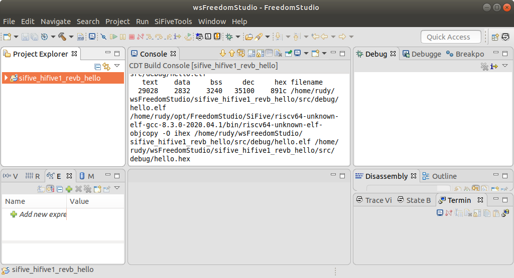

依次在菜单栏中选择【File】->【New】->【Freedom E SDK Software Project】新建工程。

由于目前 Freedom Studio 还没有支持 Sparkfun RED-V，好在 RED-V 硬件基本兼容 HiFive1-revb，因此我们选择 sifive-hifive1-revb。然后选择 hello 示例程序。

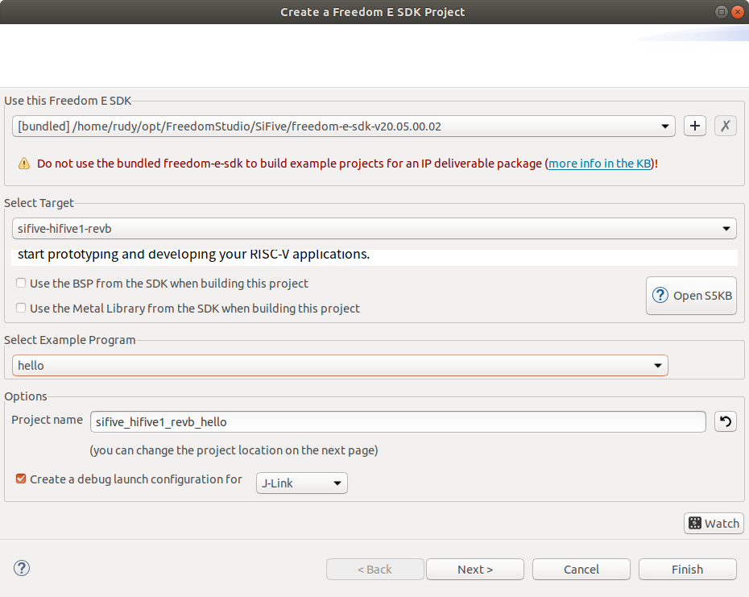

选择 Jlink 下载，然后点击 Finish 创建工程。

把 RED-V 开发板连接到电脑，电脑会识别出两个虚拟串口和一个名为 hifive 的 U 盘。如果是 Windows 系统，打开设备管理器可以看到如 JLink CDC UART Port (COM16) 和 JLink CDC UART Port (COM17) 的设备。如果是 Linux 系统，可以看到 /dev/ttyACM0 和 /dev/ttyACM1 设备。

我们可以在右下角的 Terminal 窗口打开调试串口，参数设置如下：

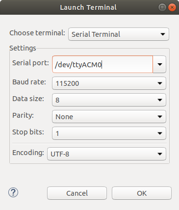

> 由于 NXP K22 ARM Cortex-M4 控制器实现的 JTAG 来自 HiFive1-Rev-B 设计方案，因此保留了两个虚拟串口，但是 RED-V 没有 ESP32 模块，因此我们选择第一个串口即可。

打开 src/hello.c 源文件，内容如下：

```c
/* Copyright 2019 SiFive, Inc */
/* SPDX-License-Identifier: Apache-2.0 */

#include <stdio.h>

int main() {
    printf("Hello, World!\n");
}
```

点击工具栏的“锤子”构建工程，编译完成后将在 src/debug 目录下生成 hello.elf 文件。右键点击 hello.elf，选择【Debug As】->【SiFive J-Link Launch】下载程序并进入 Debug 模式。运行程序，在 Terminal 窗口可以看到 RED-V 打印的“Hello, World!”字符串。

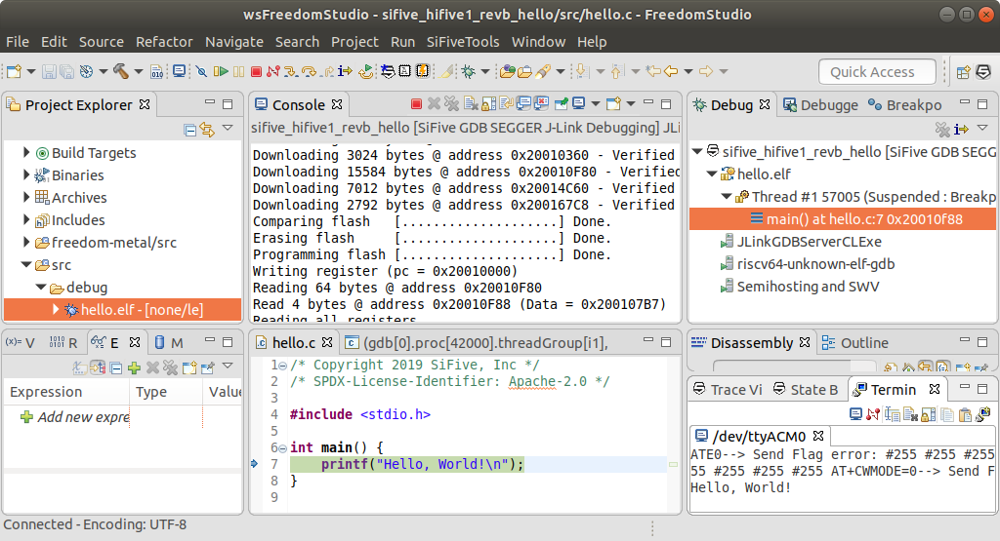


## LED 闪烁

RED-V 板卡提供了一颗用户 LED，与 SPI1_SCK / IO5 引脚相连。

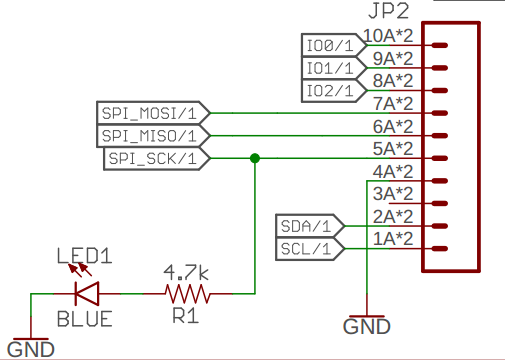

我们这里使用的是 Freedom E SDK 的接口函数，驱动 LED 闪烁需要控制 GPIO 引脚和翻转时间，因此引入 metal/gpio.h 和 metal/time.h 两个头文件。

metal 是基于驱动对象设计的，在 bsp/core.dts 设备树中定义了一个 gpio 节点。因此，我们需要先通过 `metal_gpio_get_device(0)` 找到该 gpio0 对象。

```json
gpio0: gpio@10012000 {
    compatible = "sifive,gpio0";
    interrupt-parent = <&plic>;
    interrupts = <8 9 10 11 12 13 14 15 16 17 18 19 20 21 22
                  23 24 25 26 27 28 29 30 31 32 33 34 35 36
                  27 28 29>;
    reg = <0x10012000 0x1000>;
    reg-names = "control";
};
```

修改 hello.c 文件，实现 1Hz 频率 LED 闪烁功能。

```c
#include <stdio.h>
#include <metal/gpio.h>
#include <metal/time.h>

#define LED_PIN    5

void delay_ms(int ms) {
    clock_t begin = clock();
    while ((clock() - begin) < (ms * 1000));
}

int main()
{
    printf("Hello, World! \n");
    
    struct metal_gpio *led0 = metal_gpio_get_device(0);
    if (led0 == NULL) {
        printf("Not found GPIO device.\n");
    }
    
    metal_gpio_enable_output(led0, LED_PIN);
    metal_gpio_disable_pinmux(led0, LED_PIN);
    metal_gpio_set_pin(led0, LED_PIN, 1);
    
    while (1) {
        metal_gpio_toggle_pin(led0, LED_PIN);
        delay_ms(500);
    }
    return 0;
}
```

编译、下载程序，将会看到板载的 LED 灯开始闪烁。

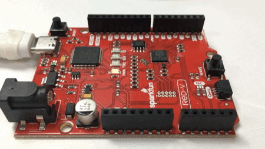


## 小结

总的来说 RED-V 是一款性价比很高的开发板，下载调试非常方便，兼容 Arduino 接口可玩性也很高。虽然 FreedomStudio 的软件使用还是比较复杂，上手需要花点功夫（目前在 Linux 系统下已有支持 Arduino IDE 的版本），但想快速 DIY 一些有趣项目还是不错的。

所以我们看到，从 SoC 到开发板整体设计来说都是非常简洁，没有过多的花样，对于想了解和学习这个极具前景的开源 CPU 架构来说，RED-V 颇具性价比，非常适合作为学习 RISC-V 架构处理器的入门开发板。


## 参考资料

- <https://www.sifive.com/software>
- <https://docs.platformio.org/en/latest/boards/sifive/sparkfun_redboard_v.html>


## SiFive 资源介绍

### Freedom E SDK

The Freedom E SDK is a repository of demo programs, industry standard benchmarks, and board support packages (BSPs) for our hardware platforms. Running benchmark code on our development boards is as easy as building a single Makefile target.

```shell
git clone --recursive https://github.com/sifive/freedom-e-sdk.git
```

取并检出任何嵌套的子模块。


### Freedom Studio

Freedom Studio 是 SiFive 公司推出的一个集成开发环境，用来编写和调试基于 SiFive 处理器的软件。内嵌了编译好的 RISC-V GCC 工具链、OpenOCD、以及一些示例和文档。

Freedom Studio is the fastest way to get started programming with your SiFive hardware. Freedom Studio is built on top of the popular Eclipse IDE and packaged with a prebuilt toolchain and example projects from the Freedom E SDK. Freedom Studio is compatible with all SiFive RISC-V development boards.

We highly recommend downloading and reviewing the [Freedom Studio User Manual](https://static.dev.sifive.com/dev-tools/FreedomStudio/2020.06/freedom-studio-manual-4.7.2-2020-06-0.pdf) before downloading and installing Freedom Studio. This manual has important information about preparing your host system to help you get up and running as quickly as possible. Please note that the Freedom Studio IDE no longer runs on CentOS 6.


### Prebuilt RISC‑V GCC Toolchain and Emulator

Save time by using one of our prebuilt toolchains which contain all the tools necessary to compile and debug programs on SiFive products. No hardware, no problem as the QEMU emulator packages can be used to test software applications without hardware. Our toolchain and emulator distributions have been carefully packaged to support both 32-bit & 64-bit ISAs. All the available packages are built using our [Freedom Tools](https://github.com/sifive/freedom-tools/releases) GitHub repository.

- GNU Embedded Toolchain
- OpenOCD
- QEMU
- Spike Disassembler


### Freedom U SDK

The Freedom U SDK is a repository containing everything needed to build a Linux-based board support packages (BSP) targeting SiFive hardware and emulation platforms.

```shell
git clone https://github.com/sifive/freedom-u-sdk.git
```


### Pre-Built Linux BSP

Already have a HiFive Unleashed and want to get started right away? Download the latest pre-built image below and follow the instructions in [Freedom U SDK](https://github.com/sifive/freedom-u-sdk) for writing the image to the Micro SD Card.


### Third Party RISC‑V Tools

A vibrant third-party ecosystem has evolved around the free and open RISC‑V ISA. The following tools are not developed nor maintained by SiFive, but may be worth considering for your next project.

#### Ashling

[Ashling](https://www.ashling.com/) is a world-class technology partner offering integrated solutions, tools, and design services that are at the heart of the embedded environment. Ashling RiscFree™ C/C++ for RISC-V, is a fully integrated development tool environment that includes an IDE, compiler, debugger, and Opella-XD JTAG probe ready to use with SiFive’s RISC-V Core IP products. A single download and install provides out of the box functionality and support for SiFive IP cores. Ashling brings in the added value of offering tools customization of any ISA extension, for both compiler and debugger, to support SiFive’s customer base.


- [Ashling RiscFree™ C/C++ for RISC-V](https://www.ashling.com/sifive)
- [Ashling Tools Customization Services](https://www.ashling.com/services-taas)
- [Ashling Multi-core (Heterogeneous) Debug](https://www.ashling.com/multi-core)

#### GNU MCU Eclipse

[GNU MCU Eclipse](https://gnu-mcu-eclipse.github.io/) is an open source project that includes a family of Eclipse plug-ins and tools for multi-platform embedded development, based on GNU toolchains. The RISC‑V architecture is fully supported, and the Eclipse plug‑ins allow users to create and build C/C++ projects. The debugging plug-ins support SEGGER J‑Link, OpenOCD, and QEMU—and include a detailed peripheral register viewer.

- [GNU MCU Eclipse IDE for C/C++ Developers](https://github.com/gnu-mcu-eclipse/org.eclipse.epp.packages/releases)
- [GNU MCU Eclipse RISC-V Embedded GCC](https://github.com/gnu-mcu-eclipse/riscv-none-gcc/releases)
- [GNU MCU Eclipse OpenOCD](https://github.com/gnu-mcu-eclipse/openocd/releases)

#### IAR Systems

[IAR Systems](https://www.iar.com/) is a truly global company at the top of our industry, providing world-leading software for building embedded applications for more than 30 years. We supply the tools and services that make embedded systems development fast, efficient and reliable, enabling our customers worldwide to deliver better products to their markets faster. IAR Embedded Workbench for RISC-V offers excellent optimization technology to ensure developers that the application fits the required needs and optimizes the utilization of on-board memory and necessary speed.

- [IAR Embedded Workbench for RISC-V](https://www.iar.com/iar-embedded-workbench/#!?architecture=RISC-V)

#### Lauterbach

The TRACE32® user interface and base modules support most available processor architectures. TRACE32® tools are applied in the pre-silicon phase for virtual prototyping and provide a seamless transition throughout all subsequent development phases leading to mass production. In October 2017, Lauterbach and SiFive [announced](http://www.lauterbach.com/news_446.html) TRACE32® support for RISC‑V cores.

- [TRACE32® debugger for RISC-V](http://www.lauterbach.com/bdmriscv.html)

#### PlatformIO

[PlatformIO](https://platformio.org/) is a unique, open source, cross-platform and hardware-agnostic solution that provides developers with a modern integrated development environment that includes advanced embedded instruments for debugging, unit testing, and remote management. Thanks to its flexible architecture it can be easily customized to support any RISC-V core and platform-specific SDK reducing the time required to ship your RISC-V solution to the market.

- [PlatformIO IDE](https://platformio.org/platformio-ide)
- [SiFive development platform: examples, configuration, supported boards](https://docs.platformio.org/en/latest/platforms/sifive.html)

#### SEGGER

[SEGGER Microcontroller](https://www.segger.com/) is a supplier of software, hardware, and development tools for embedded systems. SEGGER offers support throughout the development process with easy-to-use tools and middleware components.

- [Embedded Studio](https://www.segger.com/products/development-tools/embedded-studio/editions/risc-v/) - The leading cross-platform IDE for embedded C/C++ development. Available for Windows, macOS, and Linux.
- [J-Link](https://www.segger.com/products/debug-probes/j-link/) - With unparalleled performance and an extensive feature set, J-Link offers the world’s most widely-used debug probes.


## Hello World！

RED-V 使用很简单，它只需要一根 Type-C 的 USB 线就可以开始工作。软件开发需要用到 Freedom Studio IDE，可以在 SiFive 官网下载。如果下载 Windows 版本的话，只要解压就可以直接使用，无需在安装。不过记得解压目录不能有中文和空格。

打开 FreedomStudio 软件，IDE 界面窗口包括工程目录窗口，控制台窗口，debug 窗口，输出信息窗口例如串口信息，变量及 memory 信息串口，文件编辑窗口等等，这里不多啰嗦了。

**如何点亮板卡？**

我们来试试输出一个“Hello World！”。

首先新建工程要选择 Freedom E SDK project：


target project 选择 sifive-hifive1-revb，example 例程里选择 hello，

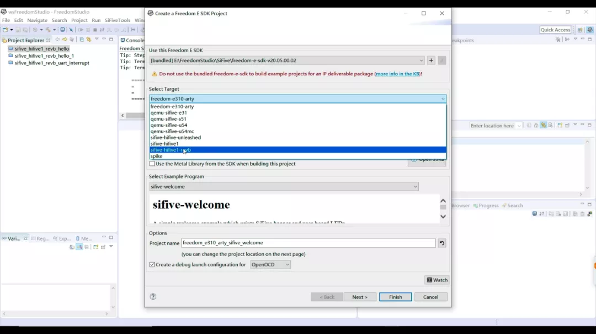

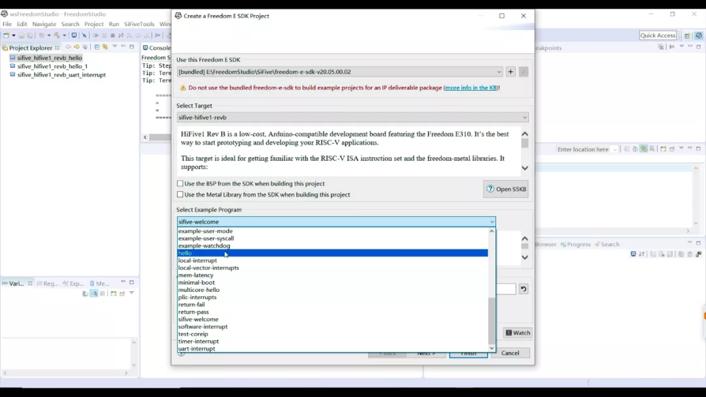

Jlink 下载，然后创建工程。

把开发板连上电脑后，打开设备管理器可以看到识别了两个虚拟串口，而且也识别了一个 hifive 名称的 U 盘。

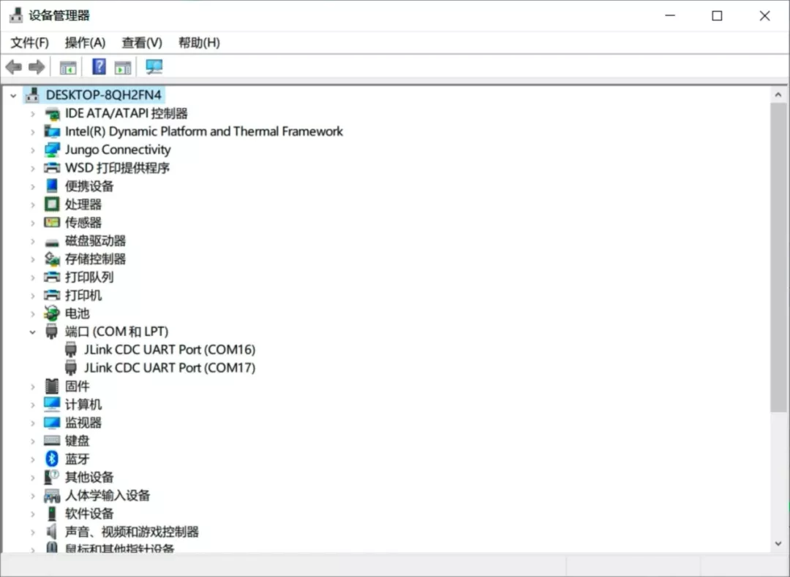

工程创建完成后先进行编译。编译完成生产了 elf 和 hex 文件，首先可以进行 debug，比如右键点击 elf 文件选择 debug。

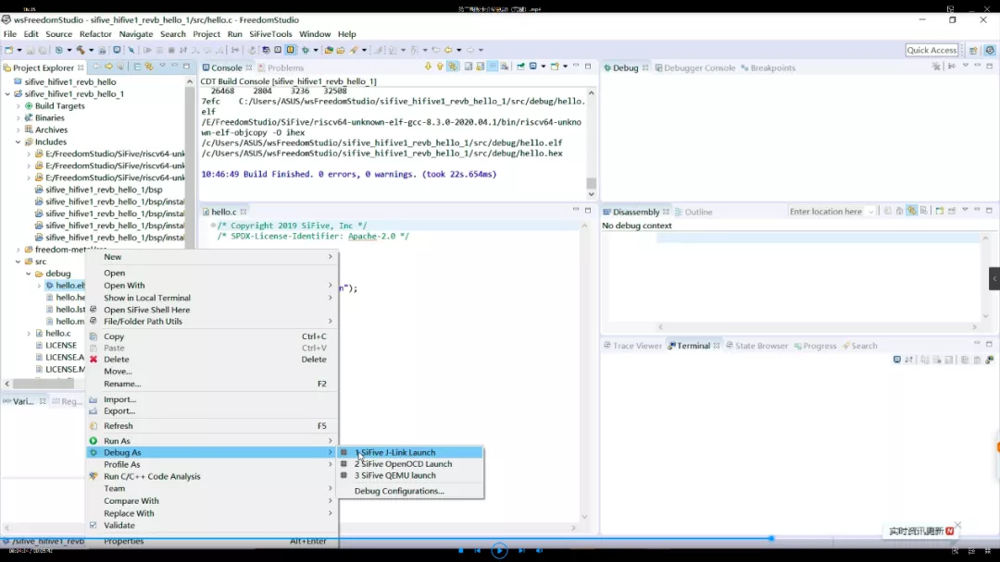

进入 debug 状态后，可以单步运行调试。在右下窗口可以打开串口监视窗口，运行后打印“hello world”。

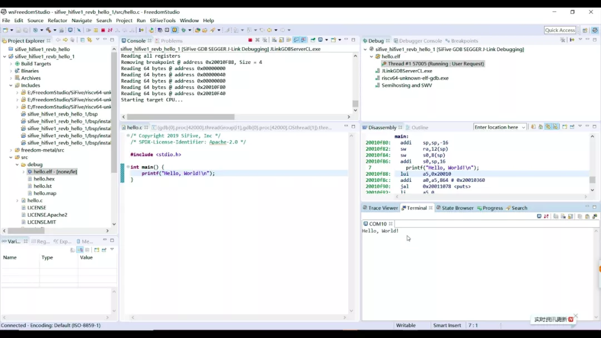

我们也可以尝试修改主程序控制用户 LED 闪烁，编译运行后生成 elf 和 hex 文件。这里其实既可以 debug 调试，也可以直接拷贝 hex 文件到 U 盘，完成后程序就烧录进去了，非常方便。

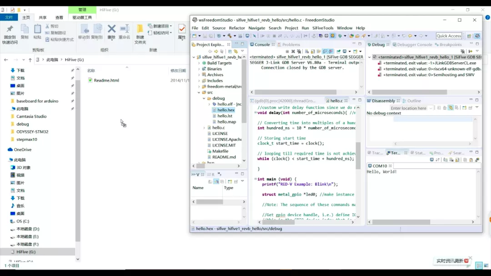

总的来说 RED-V 是一款性价比很高的开发板，下载调试非常方便，兼容 Arduino 接口可玩性也很高。虽然 FreedomStudio 的软件使用还是比较复杂，上手需要花点功夫（目前在 Linux 系统下已有支持 Arduino IDE 的版本），但想快速 DIY 一些有趣项目还是不错的。

所以我们看到，从 SoC 到开发板整体设计来说都是非常简洁，没有过多的花样，对于想了解和学习这个极具前景的开源 CPU 架构来说，RED-V 颇具性价比，非常适合作为学习 RISC-V 架构处理器的入门开发板。


## Hello RISC-V

```c
/* Copyright 2019 SiFive, Inc */
/* SPDX-License-Identifier: Apache-2.0 */

#include <stdio.h>

int main() {
    printf("\n\n");
    printf("         5555555555555555555555555\n");
    printf("        5555                   5555\n");
    printf("       5555                     5555\n");
    printf("      5555                       5555\n");
    printf("     5555       5555555555555555555555\n");
    printf("    5555       555555555555555555555555\n");
    printf("   5555                             5555\n");
    printf("  5555                               5555\n");
    printf(" 5555                                 5555\n");
    printf("5555555555555555555555555555          55555\n");
    printf("  55555          555555555           55555\n");
    printf("    55555          55555           55555\n");
    printf("      55555          5           55555\n");
    printf("        55555                  55555\n");
    printf("          55555              55555\n");
    printf("            55555          55555\n");
    printf("             55555       55555\n");
    printf("               55555   55555\n");
    printf("                 555555555\n");
    printf("                   55555\n");
    printf("                     5\n\n");

    printf("               Hello, RISC-V!\n");
}
```

