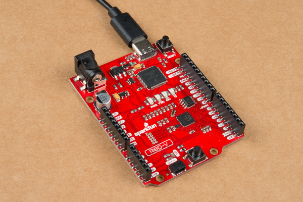
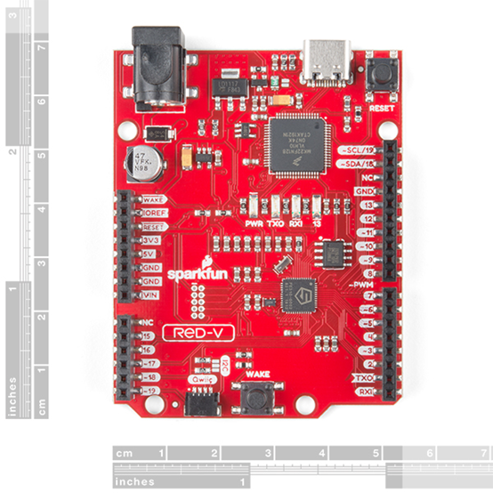
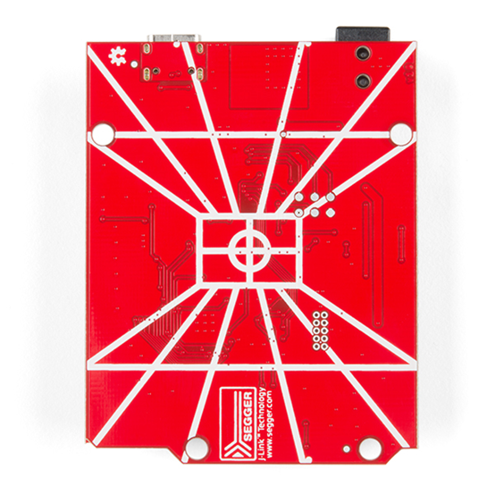
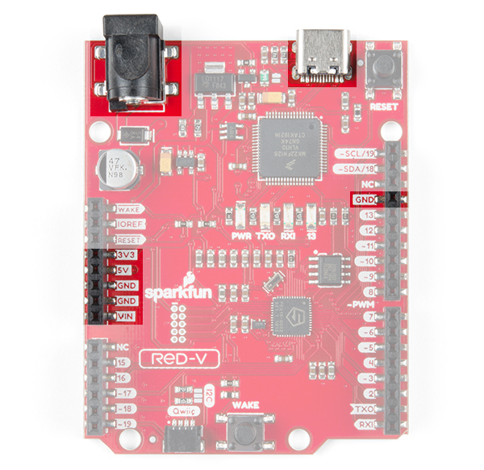
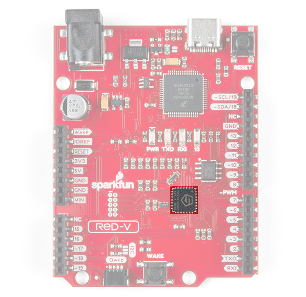
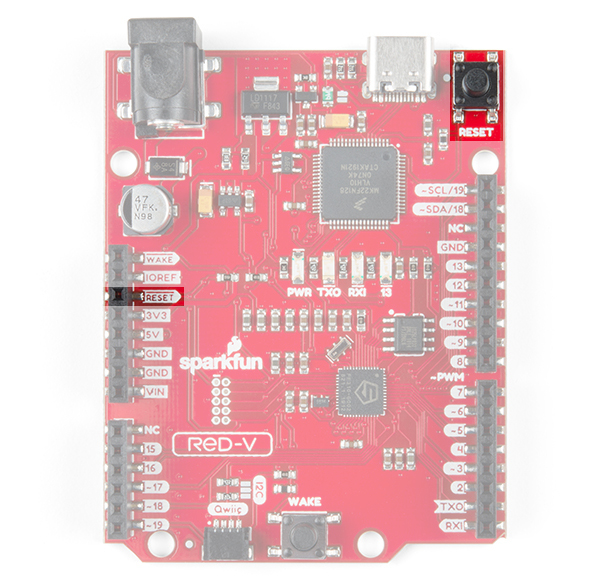
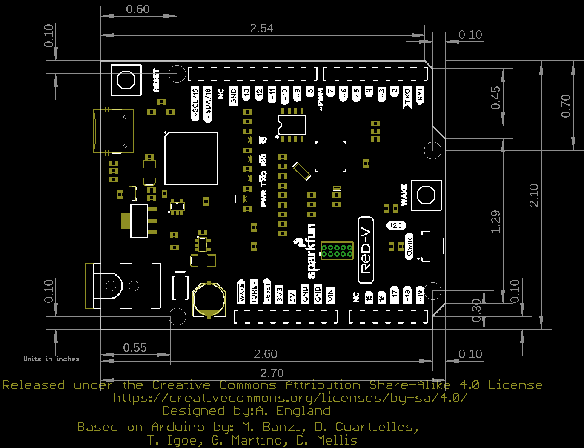

# RED-V 板卡介绍

[SparkFun 出品的开源开发板 RED-V RedBoard](https://www.sparkfun.com/products/15594)。基于 RISC-V 架构的 SoC SiFive FE310。FE310 是全球第一款基于 RISC-V 架构的 32 位商用 SoC，采用了 180nm 的工艺，最大工作频率可以到 320MHz，性能大致相当于 Arm Cortex-M3。

RED-V 是一个低成本的开源开发板，大小和流行的 Arduino 板子一样，接口兼容 Arduino Uno R3 版。板子采用了全贴片设计，没有通孔焊接，所以不用担心背面短路。

RED-V 板子采用了全贴片设计，没有通孔焊接，很漂亮，且使用时不用担心背面短路。开发板上集成了强大的 Jlink OB 下载器，可以作虚拟串口、U 盘以及 USB 转 JTAG 调试。

板上除了 Jlink 功能，其他的所有硬件软件完全开源，包括 RISC-V 指令集架构。

核心的 Freedom E310-002 (FE310) 是 SiFive 的 Freedom Everywhere 可定制 SoCs 系列 FE310 的一个升级版本，最大主频提高了一倍多达到 320MHz。它是专为微控制器、嵌入式、物联网和可穿戴应用而设计的，具有 SiFive 的高性能32位 RV32IMAC 核心，性能测试表现很突出，达到了 1.61 DMIPs/MHz，甚至超过了 Arm Cortex-M4 内核。

FE310 设计很精简，包括一个 16KB 的 L1 指令缓存，一个 16KB 的数据 SRAM 暂存，硬件乘/除法器，一个调试模块，灵活的时钟产生与片上振荡器和 PLLs，以及常用的外设，包括多个 UART、PWMs、QSPI 和定时器。处理器缺少浮点运算模块和 ADC 功能，比较合适做 RISC-V 架构评估。

## 规格参数

RED-V RedBoard 采用了大家熟悉的 Arduino UNO R3 规格，板上包括 SiFive Freedom E310 内核、32MB QSPI 闪存、NXP K22 ARM Cortex-M4 控制器用于 USB 链接和 JTAG 接口，以及 Qwiic 连接器（I2C 接口）。

**板子的特性**

- 兼容 Arduino R3 封装
- 核心控制器: SiFive Freedom E310 (FE310-G002)
    - CPU: SiFive E31 CPU
    - 架构: 32-bit RV32IMAC
    - 速度: 256 MHz (默认), 320MHz (最大)
    - 性能: 1.61 DMIPs/MHz
    - 存储: 16 KB 指令缓存, 16 KB Data Scratchpad
    - 其它特性: 硬件乘法/除法器, Debug 模块, 片上晶振和 PLL 灵活产生时钟

- 工作电压: 3.3 V 和 1.8 V
- 输入电压: 5 V USB 或 7-15 VDC 插座
- IO 电压: 同时支持 3.3 V 或 5 V
- 数字 I/O 引脚数: 19
- PWM 引脚数: 9
- SPI 控制器/HW CS 引脚数: 1/3（支持3路片选）
- 外部中断引脚数: 19
- 外部唤醒引脚数: 1 (及按键)
- 主控接口(USB-C): 编程，调试，串行通信
- Qwiic 连接器

RED-V 只需要一根 Type-C 的 USB 线就可以开始工作。开发环境要到 [SiFive](https://www.sifive.com/) 官网下载开发软件 FreedomStudio。只要解压就可以直接使用，无需再安装。

RED-V 是一款开源开发板，除了其中的 Jlink下载器没有开源，其他的所有硬件软件完全开源，甚至SoC的IP也是开源。

总的来说RED-V是一款性价比很高的开发板，下载调试非常方便。兼容Arduino接口可玩性也很高，如果你想要了解学习RISC-V架构处理器，那么RED-V RedBoard是一款非常合适的入门开发板。

## 硬件

<https://learn.sparkfun.com/tutorials/red-v-redboard-hookup-guide>

### Power & Programming

有三种方法可以给 SparkFun RED-V RedBoard 上电：

- USB-C
- 电源插座
- Arduino 排针上的电源引脚

最简单（而且同时支持下载调试）的方法是通过 USB-C 将 RED-V 连接到电脑。这样，板卡将得到 5V 的电源输入，并允许开发者通过 USB-to-JTAG 接口进行编程调试。但是，一旦你给 RED-V 烧写了固件，可能希望通过其他方式进行供电。如果在 USB-C 连接器上使用电源适配器，请确保其稳定输出 5V DC。你也可以通过板卡上的电源插座供电，请确保电源适配器的输出范围在 7-15V DC。或者使用 Arduino 接口上的电源管脚供电，如果使用 `VIN` 和 `GND`，则需要提供 7-15V DC。如果使用 `5V` 和 `GND` 或 `3v3` 和 `GND`，那么分别在 5V 和 3.3V 引脚上供电时，请确保已调节电压。

### Always-On Core

FE310 包含一个 Always-On（AON）模块，可轻松控制 FE310 的电源。 它包括自己的实时时钟，并且还连接到板上的 WAKE 按钮。 这样，您就可以让 FE310 进入睡眠状态，并通过定时器或用户触发的中断将其唤醒。

### Buttons

RED-V 有两个按钮：`RESET` 和 `WAKE` 按钮。`RESET` 按钮用于重置 FE310。 单击 `RESET` 按钮将运行加载到 FE310 的 QSPI 闪存上的代码。快速双击将使 FE310 进入安全的引导加载程序模式，如果您确实把事情弄乱了，您可以通过这种方式将新代码刷写到 RED-V（比如：糟糕，我让内核进入睡眠状态，而忘记添加一个唤醒它的方法）。Arduino 接口上也有 `RESET` 引脚，用跳线把该引脚与 `GND` 连接也可以使电路板复位。

RED-V 还配备了 Always-On 或 AON 内核（如上所述），可对其进行编程以关闭 FE310 的主内核，并在按钮生成或用户生成的中断时将其唤醒。可以在软件中配置“唤醒”按钮以将FE310从深度睡眠中唤醒。 如果您想使用外部信号源唤醒FE310，则此按钮也将断开至最接近桶形插孔的插头引脚。 从该引脚到GND添加跳线也将唤醒电路板。

The RED-V is also equipped with an Always-On or AON core (mentioned above) which can be programmed to shut down the main core of the FE310 and wake it up upon a button-generated or user-generated interrupt. The `WAKE` button can be configured in software to wake the FE310 from deep sleep. This button is also broken out to the header pin nearest the barrel jack if you'd like to use an external source to wake the FE310. Adding a jumper wire from this pin to GND will wake the board as well.

## 尺寸

## HiFive1 Rev B

HiFive1 Rev B是一款基于FE310 SoC的低成本开发板的升级版本。这是开始原型化和开发你专属的RISC-V应用的最佳方式。

## 参考资料

- [RED-V Schematic](https://cdn.sparkfun.com/assets/d/d/1/e/7/RedFive.pdf) 
- [RED-V Development Guide](https://learn.sparkfun.com/tutorials/red-v-development-guide)
- [Getting Started with the SparkFun Red-V](https://www.digikey.dk/da/maker/projects/getting-started-with-the-sparkfun-red-v/a28c5ce7d21a452db4aa3f4b94f345f4)
- [Freedom E310-G002 Datasheet](https://cdn.sparkfun.com/assets/5/b/e/6/2/fe310-g002-ds.pdf)
- [Freedom E310-G002 Manual](https://cdn.sparkfun.com/assets/7/f/0/2/7/fe310-g002-manual-v19p05.pdf)
- [Freedom Studio User Manual](https://static.dev.sifive.com/dev-tools/FreedomStudio/2020.06/freedom-studio-manual-4.7.2-2020-06-0.pdf)

