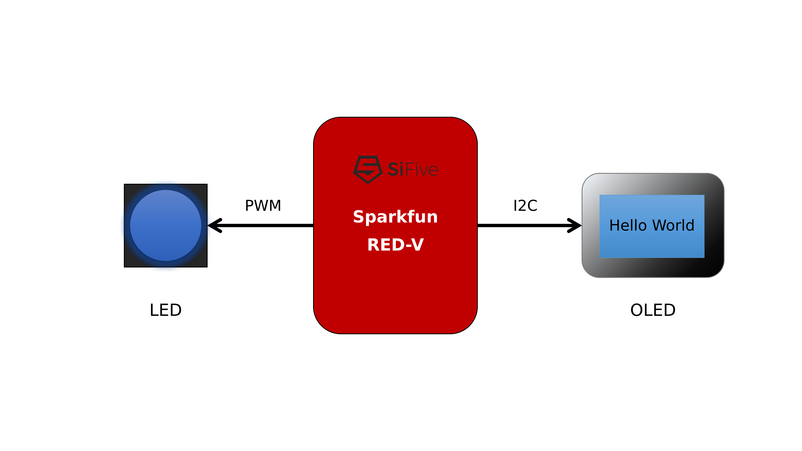

# 说明文档


## 自我介绍

大家好，我是 卢华东 Rudy，业余时间喜欢折腾一些开源软件和硬件，正在努力成为一名真正创客，利用开源和科技的力量做出能促进社会进步的产品。


## 实现功能

我在 RED-V 开发板上主要实现了两个功能：

- 驱动 PWM 实现呼吸灯；
- 驱动 I2C 显示 OLED 屏；

另外，还将 RT-Thread 移植到 RED-V 板子上。



针对这次活动和实现的功能，我一共整理了五篇文章：

1. [【RED-V】基于 RISC-V 架构的开源开发板](https://blog.csdn.net/lu_embedded/article/details/109484394)
2. [【RED-V】开发环境搭建及快速入门](https://blog.csdn.net/lu_embedded/article/details/109489080)
3. [【RED-V】驱动 PWM 实现呼吸灯](https://blog.csdn.net/lu_embedded/article/details/109492230)
4. [【RED-V】驱动 I2C 显示 OLED 屏](https://blog.csdn.net/lu_embedded/article/details/109493326)
5. [【RED-V】运行 RT-Thread 操作系统](https://blog.csdn.net/lu_embedded/article/details/109494702)

视频和代码链接如下：

- 视频介绍：<https://www.bilibili.com/video/BV1RZ4y1V7AH/> 
- 代码仓库：<https://github.com/luhuadong/RED-V>

所有代码均已放在我的 GitHub 仓库 <https://github.com/luhuadong/RED-V> 中的 code 目录。目录结构如下：

```shell
code
├── bin                 # 已编译好的可执行文件，可直接下载测试
├── red-v-hello         # Hello World 和 LED 闪烁示例工程
├── red-v-i2c           # 通过 i2c 读取 bme680/bme280/ccs811 传感器数据示例工程
├── red-v-oled          # 通过 i2c 驱动 oled 屏示例工程
├── red-v-pwm           # 通过 pwm 驱动 led 实现呼吸灯示例工程
└── rtt-sparkfun-redv   # RT-Thread 的 RED-V BSP 包
```


## 心得体会

很高兴参加 Funpack 第二期活动，这次拿到的 RED-V 是一款基于 RISC-V 的开源开发板，也是我第一次学习 RISC-V 方面的知识。RED-V 板子不仅做得很漂亮，而且有开源指令集 + 开源硬件 + 开源软件的加持，也让我对它的好感加倍。

通过这次学习，我对 RISC-V 指令集有了一个大致的了解，也折腾了 FreedomStudio 和其他几款开发工具。总体来说，RED-V 是一个不错的学习工具。当然啦，文档和开发工具仍需要不断完善。RT-Thread 对 RISC-V 硬件的支持也还有很多东西要完善，希望后续有机会将 RISC-V 做成产品。

最后，再次感谢得捷电子和硬禾学堂，感谢 Funpack 第二期的各位小伙伴！


​                                                                                                                        2020年11月4日